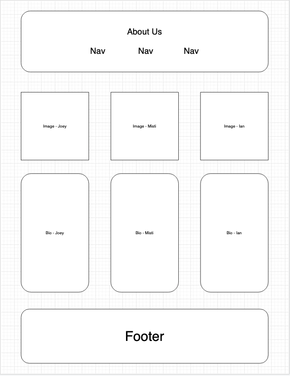
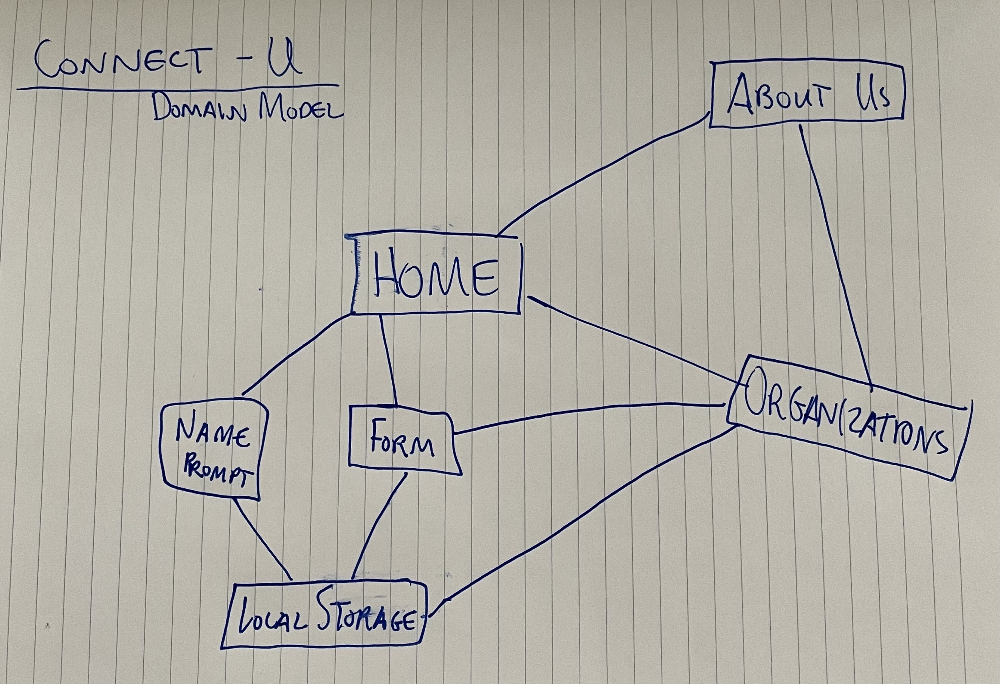

# Connect-U

## This site is deployed at:

- (joey393d.github.io/connect-u/)

## Problem Domain

- We built a site called Connect-U to help the user have easy access to local volunteer opportunities. Our idea was to create one place to come and find different options for activities, instead of searching multiple websites for each individual organization. We included the different organizations, a summary of what they do, and also contact information for each organization which allows the user to get all the information from one website.

## Author: [Joey Young](https://github.com/Joey393d), [Misti Dinzy](https://github.com/mistidinzy), [Ian Whitmore](https://github.com/iwhitmor)

## Links and Resources

- [Google Fonts](https://fonts.google.com/)

## Project Wireframes

## Project Domain Model

